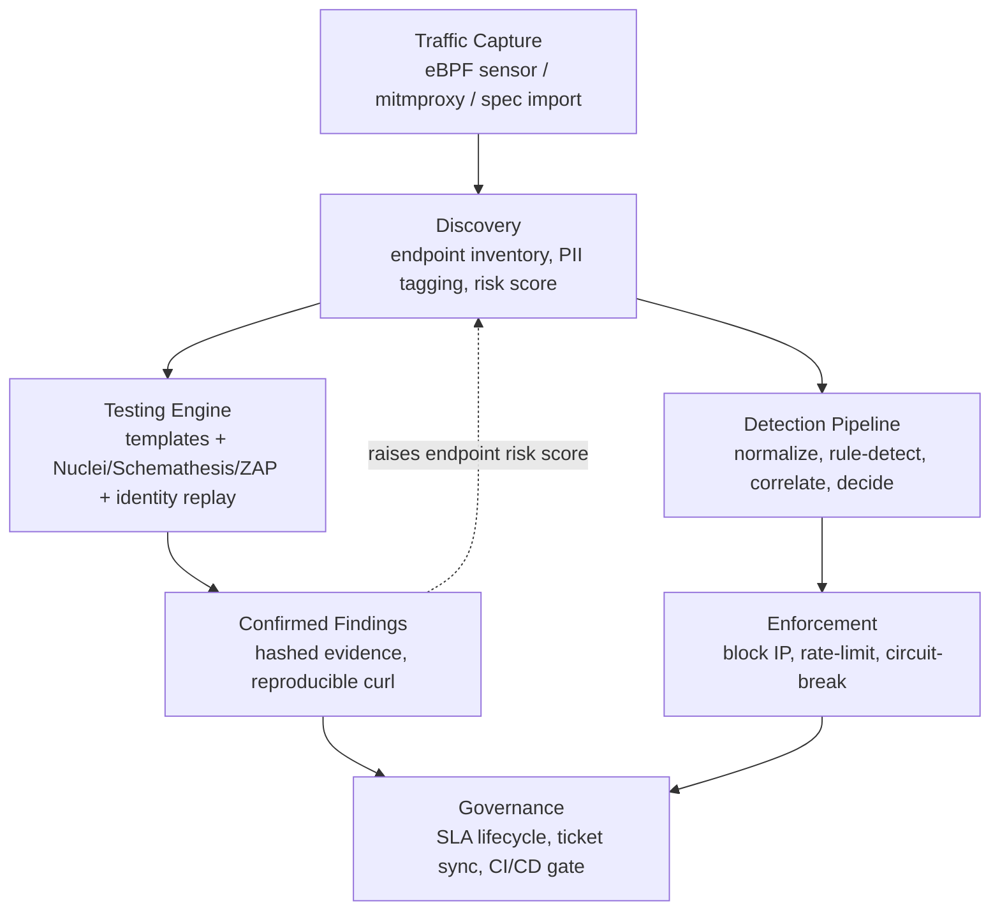

# API Sentinel — End-to-End Project Overview

*Compiled 2026-09-15. Every claim below is read from the code in this repository, not from marketing copy — file paths are given so anything here can be checked.*

---

## 1. What it is

API Sentinel is an authenticated **API red-team and runtime-protection platform**. It fuses four disciplines that most tools keep separate:

| Discipline | Question it answers | Mechanism |
|---|---|---|
| **Discovery** | What APIs do we actually have? | Passive traffic capture (eBPF sensor / mitmproxy) or OpenAPI/HAR import builds a live endpoint inventory |
| **Testing** | Which of them are actually broken? | A 2,676-file template corpus + Nuclei/Schemathesis/ZAP + multi-identity replay, run against your own allowlisted targets |
| **Protection** | Is someone attacking us right now? | A real-time detect → correlate → enforce pipeline scores and blocks live traffic |
| **Governance** | Can we prove it to a release gate or an auditor? | Hashed, redacted evidence; an SLA-bound finding lifecycle; CI/CD policy packs that fail a build on unresolved criticals |

**Scale (measured, 2026-09-15):** 322 backend Python files (~67,900 LOC) across 55 API routers · 177 frontend TypeScript/TSX files · 2,676 attack templates + remediation docs · 156 backend test files with 800+ passing cases.

---

## 2. Architecture

| Layer | Technology | Notes |
|---|---|---|
| Backend | FastAPI · Python 3.11 · SQLAlchemy 2.x (async) · Alembic | SQLite in dev, Postgres/asyncpg in production |
| Frontend | Vite 5 · React 18 · TypeScript · TanStack Query | Tailwind + Radix/shadcn; realtime WebSocket cache-invalidation, no polling |
| Auth | JWT + httpOnly cookie · permission-based RBAC | Optional Postgres row-level security (`TENANT_RLS_ENABLED`) |
| Sensors | eBPF kernel sensor ("Argus") · mitmproxy | Ships as a Kubernetes DaemonSet — full detail in §4 |
| Messaging | Redis · Kafka (optional) · Flink (optional stream job) | Falls back to an in-process pipeline when Kafka is off |
| Deploy | Docker Compose · Helm · Terraform (AWS) | Helm ships an opt-in, digest-pinned leased scan-worker Deployment |

**The one invariant every router follows:** every endpoint depends on `RBAC.require_permission(...)`, reads `account_id` off the resolved user, and filters every query on it. `tests/security/` exists specifically to catch a missing filter as a cross-tenant leak. Note also: `require_role("ADMIN")` bypasses checks unconditionally; `require_permission(...)` does not — new endpoints are written against the latter.

**Pentest safety model:** active scanning never fires blind. A `TargetGuard` enforces an allowlist plus private-IP/DNS-rebinding checks; an auth profile is required before an authenticated active scan; concurrency is capped per mode (safe/balanced/aggressive); a global kill switch can halt every in-flight and future claim instantly.

---

## 3. End-to-end flow



The loop that matters: a **confirmed** vulnerability doesn't just sit in a report — it raises that endpoint's risk score (`server/modules/vulnerability_detector/endpoint_risk.py`), and the live detection pipeline reads that score as a multiplier on future traffic to the same endpoint. Discovery, testing, and runtime protection inform each other instead of running as silos.

| | Testing Engine | Detection Pipeline |
|---|---|---|
| Trigger | On-demand, or auto-enqueued when discovery finds an untested endpoint | Continuous — every request that passes through, scan or no scan |
| Confirms via | Reproduced exploit: byte-for-byte diff on multi-identity replay, or a passing confirmatory retest | Correlated signal thresholds against a scored actor/endpoint |
| Output | `Vulnerability` row with hashed evidence | `IncidentDecision` → optional live block |

---

## 4. The sensor — how it connects and works

This is the piece that turns "a security tool you run scans with" into "a system that sees real traffic." Two independent capture paths feed the same backend pipeline; the eBPF sensor is the more sophisticated of the two.

### 4.1 What it captures and how

The sensor (codename **Argus**, `sensor/ebpf/`) is a zero-overhead **TLS plaintext capture system** running at the Linux kernel level. It does not sit on the network as a proxy — it intercepts the SSL/TLS library calls *inside* the traffic's own process, catching the plaintext the moment before it's encrypted (on write) or the moment after it's decrypted (on read). That means it works against `curl`, `nginx`, Python, or any process linking `libssl`/`libgnutls`, with **zero application changes**.

**Two components:**

| Component | Language | Role |
|---|---|---|
| Kernel BPF program (`bpf/http_trace.bpf.c`) | C (eBPF) | Attaches uprobes to `SSL_write`/`SSL_read`/`SSL_write_ex`/`SSL_read_ex`/`SSL_free` (OpenSSL) and `gnutls_record_send`/`recv` (GnuTLS); attaches a kprobe to `tcp_connect` and a kretprobe to `inet_csk_accept` to recover the real source/destination IP and port. Every captured event goes into a 128 MB ring buffer. |
| Userspace agent (`userspace/src/main.rs`, Rust/tokio) | Rust | Polls the ring buffer every 200ms, reassembles HTTP/1.1 and HTTP/2 (HPACK-decoded) request/response pairs, resolves the Kubernetes pod/container that made the call, batches the result, and POSTs it to the backend. |

**Captured:** method, path, query, headers, status code, latency, source/destination IP and port, container identity. **Not captured:** request/response bodies (metadata only), Go's native `crypto/tls` (doesn't use libssl), HTTP/3/QUIC.

### 4.2 The connection handshake — how a sensor becomes trusted

1. **Registration.** An operator calls `POST /api/sensors/register` against the backend. The server generates a random 32-byte key (`generate_sensor_key()`), stores only its **HMAC-SHA256 hash** — never the raw value — in the `Sensor` table (`server/modules/sensors/keys.py`), and returns the raw key to the operator exactly once.
2. **Deployment.** The raw key is handed to the sensor as `--api-key` (or, in the Kubernetes DaemonSet, via a mounted secret). The sensor never talks to the database directly — the key is its only credential.
3. **Ingest.** Every batch the sensor sends carries `Authorization: Bearer <sensor_key>`. The backend recomputes the HMAC of the presented key and looks up the matching `Sensor` row (`resolve_sensor_by_key`) — a sensor key is authenticated the same way a password would be, by comparing hashes, never the raw value.
4. **Heartbeat.** The sensor (or its operator tooling) pings `POST /api/sensors/heartbeat` periodically; a sensor that stops heartbeating is marked stale/offline in the dashboard (`_mark_stale_offline_for_account`).

### 4.3 The wire path — from a real request to the dashboard

```
Application process (curl, nginx, python...)
  → SSL_write() intercepted by a BPF uprobe *before* encryption
  → BPF emits a tls_event {pid, ssl_ptr, direction, cgroup_id, src/dst ip:port, plaintext} to a ring buffer
  → Rust agent polls the ring buffer, reassembles HTTP/1.1 or HTTP/2 request+response into one ApiTrafficEvent
  → agent resolves the Kubernetes pod/container from cgroup_id (via /proc + a CRI gRPC call to containerd)
  → agent batches events (every 200 events or every 1 second, whichever first)
  → POST /v1/events   (or legacy POST /)
    Authorization: Bearer <sensor_key>
    Body: { "version": "v1", "events": [ ApiTrafficEvent, ... ] }
  → server/api/main.py routes to handle_ebpf_ingest_request() in server/api/routers/stream.py
      - resolves the sensor by key → gets account_id (tenant)
      - unwraps each event, upserts the endpoint into APIEndpoint inventory (Discovery, §3)
      - persists a RequestLog row
      - runs attack-signature detection (SQLi/XSS/path-traversal/etc. patterns) inline
      - updates ThreatActor risk scoring for the source IP
      - broadcasts the event over WebSocket to any connected dashboard (Live Feed)
      - raises an Alert for HIGH/CRITICAL matches
```

Two ingest routes exist outside the normal `/api` prefix specifically for this: `POST /v1/events` and the legacy `POST /` — both delegate to the same `handle_ebpf_ingest_request`, and both authenticate with the sensor's bearer key rather than a user JWT, since a kernel sensor has no human session.

### 4.4 Where it actually runs

In this project's own cluster (`wecrew`, per `PROJECT_MEMORY.md`), the sensor runs as a Kubernetes **DaemonSet** (`k8s/35-sensor.yaml`) — one pod per node — with `hostPID: true` and `hostNetwork: true` (required to see every process's syscalls and the real source IPs) and `privileged: true` (required to load BPF programs). It ingests in-cluster via `POST /v1/events` directly to the backend Service, so no traffic leaves the cluster to be inspected.

### 4.5 The simpler alternative: mitmproxy

Where a full kernel sensor is more than a deployment needs, `server/modules/traffic_capture/mitmproxy_integration.py` runs mitmproxy as a TLS-terminating proxy in front of a target and forwards captured flows through the same ingest path. It's less invasive to deploy (no privileged DaemonSet) but does sit in the traffic path as a proxy, unlike the eBPF sensor which observes traffic in place without redirecting it.

### 4.6 Honest limitations (as documented in `docs/eBPF_Sensor_Architecture.md`)

- No support for Go's native TLS stack, HTTP/3/QUIC, or WebSocket frame parsing yet.
- Request/response **bodies** are not captured by the eBPF path today — only metadata. Payload-based attack detection (e.g., a malicious value buried in a JSON body) depends on the mitmproxy path or template-based active testing instead.
- Container enrichment (pod/namespace/service name) only works inside Kubernetes, via a cgroup-path parse and a CRI gRPC call to containerd.

---

## 5. Feature inventory, with an honest status

`proven` = runs end-to-end today. `partial` = real logic with a named gap. `pending` = designed but not yet wired up.

| # | Capability | Status | What it does | Key files |
|---|---|---|---|---|
| A | Discovery & Inventory | **proven** | Builds a live `APIEndpoint` catalogue from passive traffic or an imported spec; tags likely-PII fields; auto-generates and diffs OpenAPI snapshots to flag drift | `server/modules/api_inventory/` |
| B | Template + Engine Testing | **proven** | 2,676-file YAML corpus plus Nuclei/Schemathesis/ZAP adapters. External engines now run in a **queued** worker bound to a target URL and a sha256-hashed OpenAPI spec, not inline in the request | `server/modules/test_executor/scan_worker.py`, `pentest/engine_plan.py` |
| C | Multi-Identity Replay | **proven** | BOLA/BFLA confirmation by literally replaying a victim's request with an attacker's credentials and diffing real responses — the platform's most differentiated, benchmark-verified capability | `server/modules/identity/authorization_replay.py` |
| D | Detection & Correlation | **proven** | Always-on pipeline: normalize → rule-detect → correlate → decide. Runs in `shadow` (observe only) or `active` (owns alerts/evidence/enforcement) mode via a config flag | `docs/detection-engine/`, `server/modules/detection/` |
| E | Enforcement | **proven** | IP blocks, rate limits, per-endpoint circuit breakers, triggered by a correlated `IncidentDecision` rather than a single raw signal | `server/api/routers/protection.py` |
| F | Evidence & Lifecycle | **proven** | Every finding is redacted, sha256-hashed, and reproducible as a curl command. Closing a finding requires a hash-verified, `CLEAN` confirmatory retest — the closure gate rejects the request otherwise | `test_executor/evidence.py`, `vulnerability_detector/lifecycle.py` |
| G | Business-Logic & Agentic Testing | **partial** | Coupon-reuse and OTP-throttle scenarios run today. An opt-in LLM layer *proposes* exploit attempts, but a guard layer disposes — the model never gets to declare a finding on its own. Live LLM fixtures for prompt injection/RAG exfiltration aren't yet wired to a deterministic judge | `server/modules/business_logic/`, `agentic/` |
| H | Governance & CI Gates | **partial** | CI/CD policy packs (`strict`, `llm-strict`) can fail a build on unresolved CRITICAL/HIGH findings; every job must produce a non-empty SARIF/JUnit artifact. SARIF upload is still conditional on the file existing rather than required outright | `.github/workflows/ci.yml`, `server/modules/cicd/policy_packs.py` |

---

## 6. Maturity and what's left

The North Star gap analysis (2026-09-13) put it plainly: **the platform can report a capability as ready from function or config presence, even when the deployed path can't actually execute it end to end.** 156 test files and 800+ passing cases validate contracts and mocked adapters — they do not yet prove a real isolated worker has executed Schemathesis, Nuclei, or ZAP against an allowlisted API in a live staging cluster. That run has not happened yet.

**Shipped in the current patch (2026-09-14):** queued external-engine execution bound to a hashed OpenAPI spec · honest preflight (`production_verified: false` on every prepare call) · scanner subprocess cleanup on cancellation · an opt-in, digest-pinned Helm scan-worker · six shared contracts (scan status, engine outcome, finding confirmation, evidence format, artifact ownership, cancellation) written down with file references.

**Still required before "production-ready" is a fact, not a label:**

1. A real scanner canary against an owned staging target, including auth expiry, cancellation, and crash recovery.
2. Per-run Kubernetes Job isolation — today's worker is a leased Deployment, not one pod per scan.
3. Full identity-matrix replay (two users, an admin, a second tenant) on every ordinary scan, not just the benchmark path.
4. A durable, stateful business-flow executor with real setup/mutation/cleanup, not just single-request checks.
5. Aggregating external-engine results into run counters, unified reports, and ticket transitions.
6. Required (not optional) SARIF/JUnit generation, plus action and scan-worker binary provenance.
7. Production RLS validated with real cross-tenant negative tests, on a cluster where it's actually enabled.

**Source of truth:** `NORTH_STAR_IMPLEMENTATION_STATUS.md` (backlog) · `docs/SHARED_CONTRACTS.md` (the six contracts) · `docs/SPRINT_1_PLAN.md` (who's doing what) · `docs/PROJECT_END_TO_END.md` and `PROJECT_MEMORY.md` (living architecture notes) · `docs/eBPF_Sensor_Architecture.md` (the sensor, in full depth).
